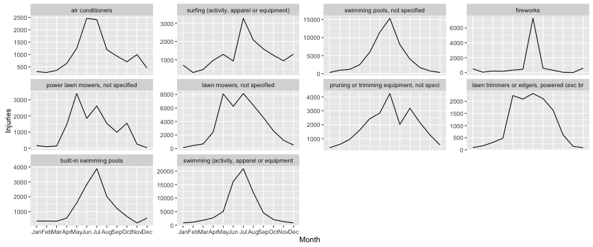

## Project Overview

* Visualize the NEISS product injuries data for 2014
  * The NEISS collects product-related injury data from select US emergency rooms and extrapolates to the entire US
* Focus on injuries that are not uniformly distributed throughout the year

--- .class #id 

## Potential Uses

* Timely targeted public outreach campaigns
  * Increase safety awareness
  * Reduce seasonal injuries
* Provide additional training to medical and EMS personnel on expected injuries

--- .class #id 

## Example Plot

Here's a compelling example for July, showing the seasonal spikes in swimming and fireworks injuries.

